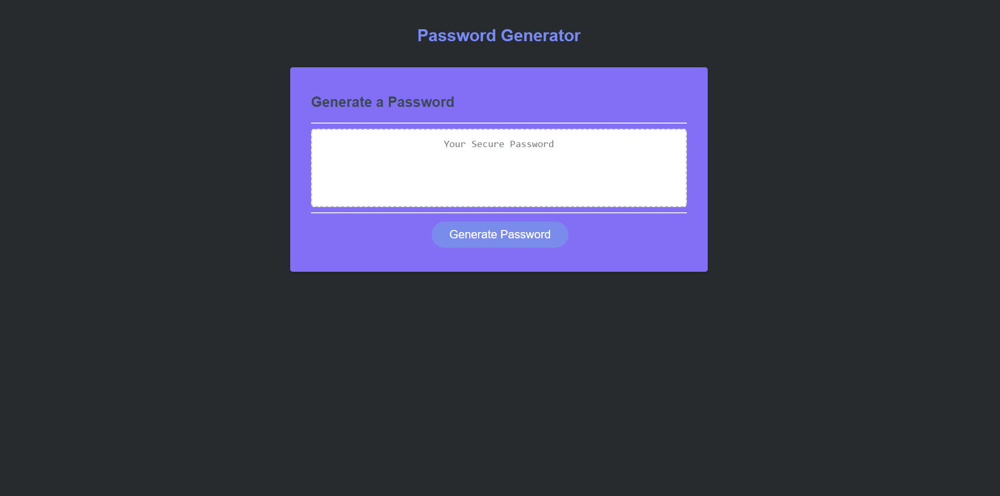

# password-generator-javashowcase
This repository was used to create a password generator using concepts learned from Javascript to showcase our abilities and understanding of the language. 

The following image shows the web application's appearance and functionality:



 Deployed application : https://nysat.github.io/password-generator-javascript-showcase/


## User Story
```
AS A marketing agency
I WANT a codebase that follows accessibility standards
SO THAT our own site is optimized for search engines
```

## Acceptance Criteria

```
THE webpage meets accessibility standards
WHEN you view the source code
YOU will find semantic HTML elements
WHEN you view the structure of the HTML elements
YOU will find that the elements follow a logical structure independent of styling and positioning
WHEN you view the icon and image elements
YOU will find accessible alt attributes
WHEN you view the heading attributes
YOU will find they fall in sequential order
WHEN you view the title element
YOU will find a concise, descriptive title
```
## License

Licensed under the MIT license.

